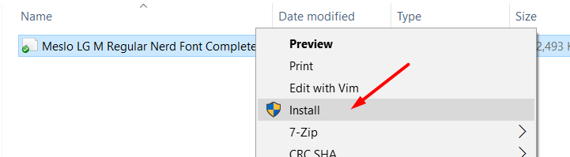
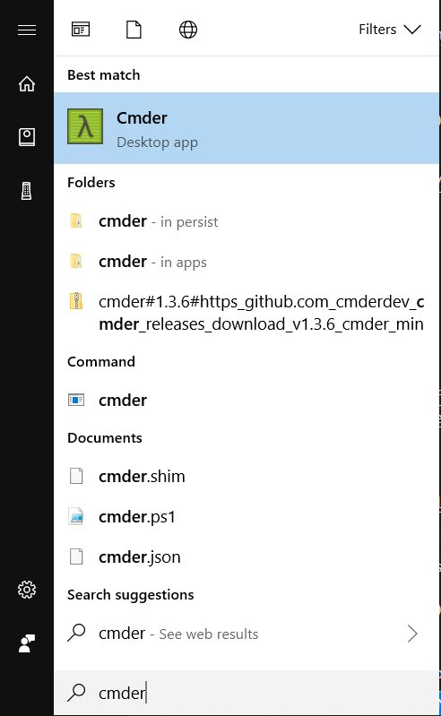
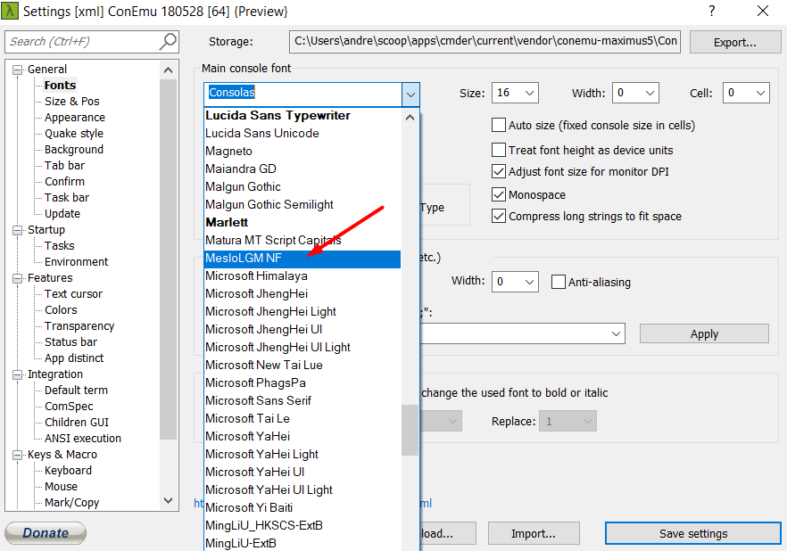
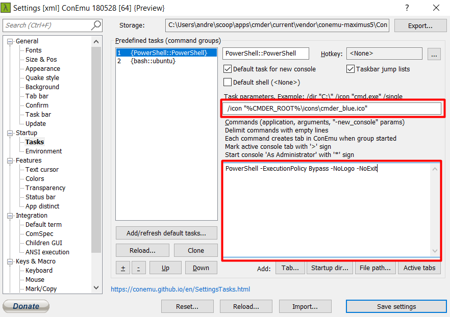
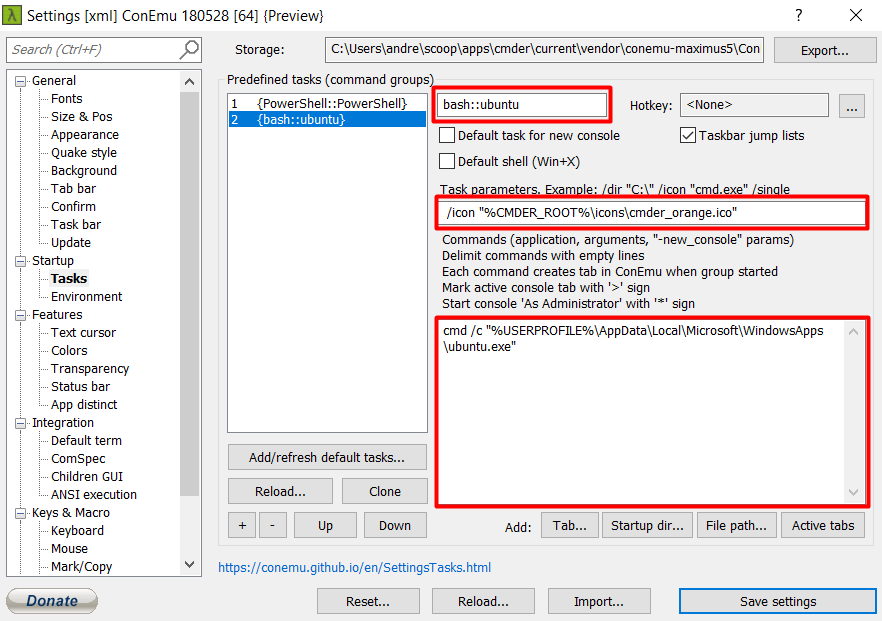
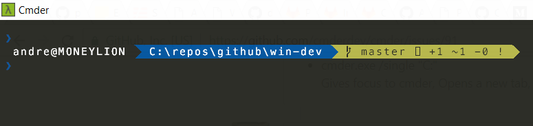

# win-dev
Development environment on Windows

## Windows Subsystem for Linux
Run bash on Windows.

### Installation
1) Open PowerShell.
2) Enable Windows Subsystem for Linux.
    ```
    > Enable-WindowsOptionalFeature -Online -FeatureName Microsoft-Windows-Subsystem-Linux
    ```
3) Install [Ubuntu](https://www.microsoft.com/en-us/p/ubuntu/9nblggh4msv6?rtc=1)

### References
- [Windows 10 Installation Guide ](https://docs.microsoft.com/en-us/windows/wsl/install-win10)

## scoop
Command line installer for Windows.

### Installation
1) Open PowerShell.
2) Set the execution policy.
    ```
    > set-executionpolicy remotesigned -s currentuser
    ```
3) Install scoop.
    ```
    > iex (new-object net.webclient).downloadstring('https://get.scoop.sh')
    ```
4) Add extras and versions buckets.
    ```
    > scoop add bucket extras
    > scoop add bucket versions
    ```

### Usage
Search for packages
```
> scoop search vim
```
Install a package
```
> scoop install vim
```

### References
- [scoop GitHub](https://github.com/lukesampson/scoop)

## Vim
Text editor to speed up your typing.

### Installation
1) Open PowerShell.
2) Install Vim.
    ```
    > scoop install vim
    ```
### Usage
Open vim in current directory.
```
> vim .
```
Open a file in vim
```
> vim ./my-file.txt
```

## Visual Studio Code
IDE to speed up your development.

### Installation
1) Open PowerShell.
2) Install VS Code.
    ```
    > scoop install vscode
    ```

### Usage
Open current directory in VS Code.
```
> code .
```

Open file in VS Code.
```
> code ./my-file.txt
```

### References
- [VS Code Homepage](https://code.visualstudio.com/)

## Git
Version control.

### Installation
1) Open PowerShell.
2) Install Git.
    ```
    > scoop install git
    ```

## Docker and docker-compose
Container management.

### Installation
1) Open PowerShell.
2) Install Docker.
    ```
    > scoop install docker
    ```
3) Install docker-compose
    ```
    > scoop install docker-compose
    ```

### Usage
View running containers
```commandline
> docker ps -a
```
View local images
```commandline
> docker images
```
Pull image from DockerHub
```commandline
> docker pull bash
```
Run a container
```commandline
> docker run -it bash
```

## cmder
Portable console emulator.

### Installation
1) Open PowerShell.
2) Install cmder.
    ```
    > scoop install cmder
    ```
3) Download [Meslo font](https://github.com/ryanoasis/nerd-fonts/blob/master/patched-fonts/Meslo/M/complete/Meslo%20LG%20M%20Regular%20Nerd%20Font%20Complete%20Windows%20Compatible.otf).
4) Right click on download font and click 'Install'.

    

5) Open cmder from start menu.

    

6) Open cmder settings using keyboard shortcut `Win-Alt-P`.
7) Set the font.

    

8) Set the PowerShell task.

    

9) Set the Ubuntu task. Change the path to use your username.

    

10) Pin cmder to the task bar. If it is the first item then you
can access it using the keyboard shortcut `Win-1`.

    

### References
- [cmder](http://cmder.net/)
- [Medium Perfect Windows Dev]( https://medium.com/@pranjalpaliwal/perfect-dev-environment-on-windows-the-easiest-way-691c649850eb

## posh-git, oh-my-posh
Better prompt.

### Installation
1) Open cmder.
2) Open PowerShell profile.
    ```
    > vim $PROFILE
    ```
3) Add posh-git and oh-my-posh.
    ```
    Import-Module posh-git
    Import-Module oh-my-posh
    Set-Theme paradox
    ```
4) Open a new shell and view the result.

    

### References
- [posh-git](https://github.com/dahlbyk/posh-git)
- [oh-my-posh](https://github.com/JanDeDobbeleer/oh-my-posh)
- [Medium Perfect Windows Dev]( https://medium.com/@pranjalpaliwal/perfect-dev-environment-on-windows-the-easiest-way-691c649850eb

## Python
Easy to read, learn, use programming language.

### Installation
```
> scoop install python
```

### Usage
Check version.
```
> python --version
```

Run code in shell.
```
> python
Python 3.7.0 (v3.7.0:1bf9cc5093, Jun 27 2018, 04:59:51) [MSC v.1914 64 bit (AMD64)] on win32
Type "help", "copyright", "credits" or "license" for more information.
>>> x = 1
>>> y = 2
>>> x + y
3
>>>
```

### References
- [Python homepage](https://www.python.org/)

## Pipenv
Python package management.

### Installation
Install Pipenv.
```
> pip install --user pipenv
```

Open your PowerShell profile.
```
> vim $PROFILE
```

Add the following line.
```
$env:Path += ";C:\Users\<username>\AppData\Roaming\Python\Python37\Scripts"
```

Restart your shell and check the installation.
```
> pipenv
Usage: pipenv [OPTIONS] COMMAND [ARGS]...

Options:
  --where             Output project home information.
...
```

### References
- [Pipenv homepage](https://docs.pipenv.org/)

## Jupyter Lab
Web based Notebook/REPL.
### Install
```commandline
conda install -c conda-forge jupyterlab
```
### Usage
Start Jupyter
```commandline
activate py3
jupyter lab
```
Install extension
```commandline
jupyter labextension install jupyterlab_vim
```


